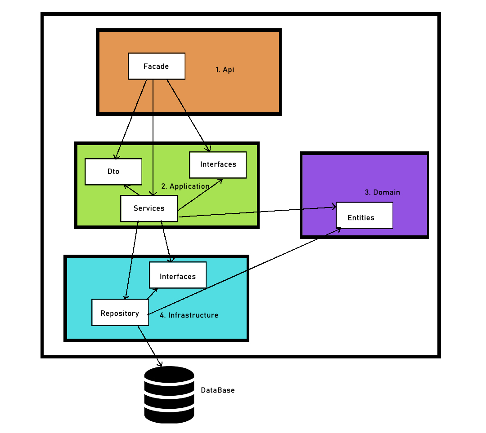

## DIAGRAMA DDD

### Red Arbor prueba técnica (Web Api)
### Descripción y contexto
---
Aplicación con arquitectura de capas DDD. Variables en App.Config y Resources.resx. Aplicado Clean Code, principios SOLID, Inyección de Dependencias y patron de diseño Facade.

####Base de Datos
Generamos la Base de Datos con los archivos de la carpeta /Sql.
Archivo: Create_Database_REDARBOR_TEST.sql  --> Para crear la Base de Datos REDARBOR_TEST
Archivo: V1__Create_Table_Employees.sql --> Para crear la tabla EMPLOYEE
Archivo: V1__Insert_into_Table_Employees.sql --> Para insertar 2 empleados, para pruebas.

También está adjuntado el archivo REDARBOR_TEST.bak para restaurar la Base de datos directamente. 
Una vez creada la DB, será necesario configurar los datos para la conexión. Estos están en el archivo de recursos \RedArbor.Infrastructure.Repository\Resources\InfrastructureResource.resx.

####Capa de Infraestructura
Tenemos separados, cumpliendo con el principio SRP, los proyectos en 2: Repositorio e interfaces.
En el EmployeeRepository tenemos las llamadas a la Base de datos empleando el Modelo EmployeeEntity para la recogida de registros.

####Capa de Dominio
En esta encontraremos la entidad EmployeeEntity. A esta capa accederán las capas de Aplicación e Infraestructura.

####Capa de Applicación
En esta encontraremos 3 proyectos: Interfaces, Service y Dto.
En el proyecto Dto, tendremos el modelo EmployeeDto. Se utiliza este modelo para trabajar en la capa de Aplicación y la capa de Presentación/Api.
En el proyecto Service, tendremos la clase EmployeeService para hacer de intermediario entre la capa de Presentación/Api y la de Infraestructura.
También tendremos las 2 clases Mapper, para mapear entre los modelos de Entidad y Dto de forma bidireccional.

####Capa de Presentación/Api - Facade
La Api actúa de Facade, como bien dice este patrón de diseño concreto, para que de ahí para abajo, el usuario no sepa nada.
EmployeeApiController para controlar todas las llamadas que entren.
He añadido la clase IocApiConfig en la carpeta App_Start. Esta es la encargada del Builder de la inyección de dependencias del Service y el Repository.

####Capa de Testing
Capa con Tests Unitarios con mocks y 2 de Integración, ya que he priorizado el resto de la Aplicación que es más importante, para por lo menos ver la presencia y el uso de los mismos.

### Guía de usuario
---
###GET  http://localhost:{puerto}/api/EmployeeApi
Devuelve todos los empleados

###GET  http://localhost:{puerto}/api/EmployeeApi/id
Devuelve un empleado mediante su id

###POST http://localhost:{puerto}/api/EmployeeApi  + Json(Employee)
Inserta un empleado en la DB pasándoleselo en formato Json

###PUT  http://localhost:{puerto}/api/EmployeeApi/1   + string("test1updated")
Actualiza el Username (mediante un string) de un empleado buscándolo por su id

###DELETE  http://localhost:{puerto}/api/EmployeeApi/1 
Elimina un empleado mediante su id

 	
### Guía de instalación
---
## SOFTWARE UTILIZADO
Windows 10 Pro 64 bits

Microsoft .NET Framework V.4.8.04084

Microsoft Visual Studio Community 2019
Versión 16.8.4

SQL Server 2017 Express

## FRAMEWORKS
-Autofac

-NewtonSoft.Json

-Moq

-MSTest

### Autor/es
---
Carlos López Santamaría
